### 总述
- 本项目是 [NVIDIA TensorRT Hackathon 2023](https://github.com/NVIDIA/trt-samples-for-hackathon-cn/tree/master/Hackathon2023) 的参赛题目，我们将[Qwen-7B](https://github.com/QwenLM/Qwen-7B)模型转换到TensorRT-LLM并部署到NVIDIA A10 GPU上。其原始模型的相关链接如下：

<div align=center>

|名称|参考连接|
|-|-|
||<https://github.com/QwenLM/Qwen-7B>|
|| <https://github.com/QwenLM/Qwen-7B/blob/main/tech_memo.md>|

</div>

- 模型复现结果(由于在测试环境中，所选模型FP32精度下显存不足，只测试了FP16和int8结果)：
  - Huggingface和TensorRT-LLM模型FP16时加速比在1.42左右，int8时加速比在2.06
  - Huggingface和TensorRT-LLM模型FP16时绝对误差在0.002左右，相对误差0.005左右
  - Huggingface和TensorRT-LLM模型int8时绝对误差在0.05左右，相对误差0.1左右

- 以下是本项目运行所需的环境，项目结构和运行方式说明：

> :tada: 1.项目所需环境

<details>
<summary>点我查看所需环境</summary>

- 主机硬件环境：`Linux version 5.15.0-73-generic (buildd@bos03-amd64-060) (gcc (Ubuntu 11.3.0-1ubuntu1~22.04.1)) `, NVIDIA显卡： `NVIDIA A10 (24G)`

- 主机软件环境：`Driver Version: 525.105.17`, `CUDA 12.1/cuDNN8.9/TensorRT-9.0.0.2`, `Docker`和`NVIDIA-Docker`

```shell
# 拉取镜像
docker pull registry.cn-hangzhou.aliyuncs.com/trt-hackathon/trt-hackathon:final_v1
# 启动容器
docker run --gpus all --name trt2023 -it --rm --ipc=host --ulimit memlock=-1 --ulimit stack=67108864 registry.cn-hangzhou.aliyuncs.com/trt-hackathon/trt-hackathon:final_v1
# 如果容器已经存在并停止
docker start trt2023
# 使用docker ps -s查看运行容器，如果正在运行，使用如下命令进入容器操作
docker exec -it trt2023 bash
```

</details>


> :tada: 2.代码结构

<details>
<summary>点我查看代码结构</summary>

```shell

# model
tensorrt_llm_july-release-v4/tensorrt_llm/models/qwen7b/model.py

# QWenMLP
tensorrt_llm_july-release-v4/tensorrt_llm/layers/mlp.py

# example
./tensorrt_llm_july-release-v1/examples/qwen7b/
├── README.md
├── benchmarks               # benchmark文件
├── build.py                 # trt模型build
├── configuration_qwen.py    # 修改的HF配置文件
├── convert.py               # 
├── hf_qwen_convert.py       # int8 kv cache scale转换文件
├── model                    # Huggingface 模型相关文件
├── profile.py               # Huggingface模型profile文件
├── run.py                   # TRT-LLM模型运行文件
├── smoothquant.py           # int8相关量化文件
├── summarize.py             # Rouge 来对比模型优化前后的精度差距
├── test_qwen.py             # 测试TRT-LLM模型的精度
├── test_qwen_int8_kv_cache.py # 测试TRT-LLM int8 kv cache模型的精度
├── test_qwen_weight_only.py   # 测试TRT-LLM iweight-only int8模型的精度
├── test_rms_norm.py           # 测试rmsnorm plugin的精度
├── test_swiglu.py             # 测试swiglu plugin的精度
└── weight.py                  # HF模型权重转换相关文件

# rmsnorm plugin
tensorrt_llm_july-release-v1/cpp/tensorrt_llm/kernels/rmsnormKernels.cu
tensorrt_llm_july-release-v1/cpp/tensorrt_llm/kernels/rmsnormKernels.h
tensorrt_llm_july-release-v1/cpp/tensorrt_llm/plugins/rmsnormPlugin/rmsnormPlugin.cpp
tensorrt_llm_july-release-v1/cpp/tensorrt_llm/plugins/rmsnormPlugin/rmsnormPlugin.h
# swiglu plugin
tensorrt_llm_july-release-v1/cpp/tensorrt_llm/kernels/swigluKernels.cu
tensorrt_llm_july-release-v1/cpp/tensorrt_llm/kernels/swigluKernels.h
tensorrt_llm_july-release-v1/cpp/tensorrt_llm/plugins/swigluPlugin/swigluPlugin.cpp
tensorrt_llm_july-release-v1/cpp/tensorrt_llm/plugins/swigluPlugin/swigluPlugin.h
```

</details>

> :tada: 3.运行方式说明

<details>
<summary>点我查看运行方式</summary>

- 1.重新编译tensorrt_llm

```shell

# 官方的docker中TensorRT位于/usr/local/TensorRT-9.0.0.2/
cd /root/workspace/tensorrt_llm_july-release-v1/

# 按照/root/workspace/tensorrt_llm_july-release-v1/README.md中说明进行安装和编译

# 如果需要重新编译所有tensorrt_llm代码
./scripts/build_wheel.py --clean --trt_root /usr/local/TensorRT-9.0.0.2/

# 编译完成之后安装tensorrt_llm
pip3 install ./build/tensorrt_llm-0.1.3-py3-none-any.whl

```

- 2.运行example中的代码
```shell
cd /root/workspace/tensorrt_llm_july-release-v1/examples/qwen7b/

# 按照examples/qwen7b/README.md中的说明运行build.py, run.py, summarize.py等.
```
</details>


### 主要开发工作
#### 模型简介
通义千问-7B（Qwen-7B） 是阿里云研发的通义千问大模型系列的70亿参数规模的模型。Qwen-7B是基于Transformer的大语言模型, 在超大规模的预训练数据上进行训练得到。预训练数据类型多样，覆盖广泛，包括大量网络文本、专业书籍、代码等。
Qwen-7B结构与LLaMA相似的架构。使用来自公开的超过 2.2 万亿个tokens的数据和 2048 个上下文长度进行预训练，训练数据覆盖一般和专业领域，在语言方面重点关注英语和中文。 与标准transformer的主要区别如下：  
- 使用untied embedding嵌入;  
- 使用旋转位置嵌入-即RoPE相对位置编码;  
- normalization实现--即RMSNorm代替LayerNorm;  
- FFN激活函数-即SwiGLU代替 ReLU。  
<p align="center">
    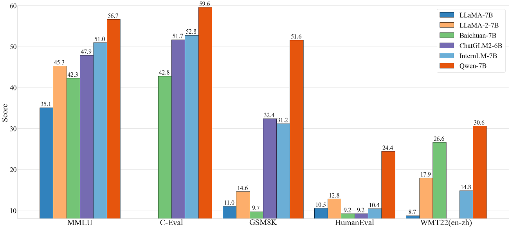
<p>
<br>

#### 开发工作的难点
我们仿照examples的代码组织形式，完成了模型搭建，并可顺利输出文本（实现weight.py/build.py/run.py），用Nsight对模型进行Profiling,并最终确定了有针对性的优化方案，包括：

- QWenMLP 冗余结构耗时
- RMSNorm 冗余结构耗时
- dynamic ntk和logn attn实现
- int8 kv cache实现
- weight-only int8实现
- rmsnorm plugin和模型精度对齐

针对于上述问题我们通过修改TRT-LLM相关源码,开发了相关的plugin和脚本.

- 模型搭建中在mlp.py中增加了QWenMLP实现(融合fc和gate为一个linear)
- 在现有的gpt attention plugin代码中添加了dynamic ntk和logn attn实现
- 实现了Rmsnorm plugin
- 实现了Swiglu plugin(速度太慢弃之)
- 仿照example中的代码实现了int8 kv cache和weight-only int8
- 实现了test_qwen.py,test_swiglu.py,test_rms_norm.py


### 开发与优化过程
- **1. QWenMLP**  
原TensorRT-LLM中的`GatedMLP`中对输入数据进行了`self.fc`和`self.gate`两个`linear`运算，然后使用了`silu`激活函数。整个网络包含32个此结构，
运行以下代码生成Nsight Profiling文件:  

```
nsys profile -o qwen python3 run.py --max_output_len=8 --tokenizer_dir ./model --engine_dir=./trt_engines/qwen/7B/trt_engines/fp16/1-gpu/
```  

在Nsight下发现GatedMLP的耗时情况如下图所示：  
<div align=center>
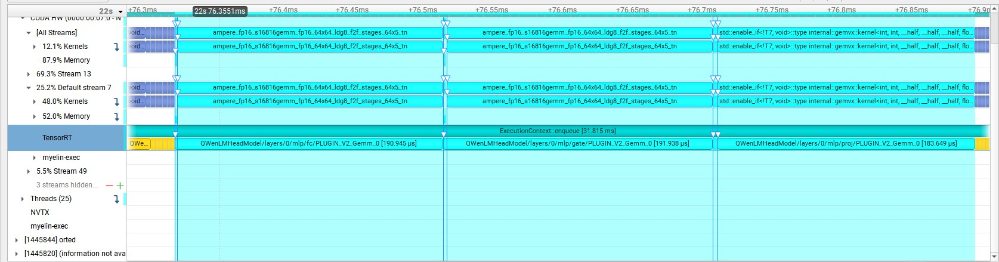
</div>
<div align=center>
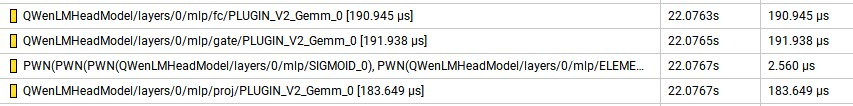
</div>  

其在一个block中的一个`GatedMLP`的耗时为569.092us，因此我们对`GatedMLP`进行了优化，把`self.fc`和`self.gate`两个`linear`融合为一个`linear`，
然后使用`swiglu`激活函数。优化后的耗时为557.795us，较优化前缩短了11.297us，相同位置的`QWenMLP`结构的Nsight如下:  

<div align=center>
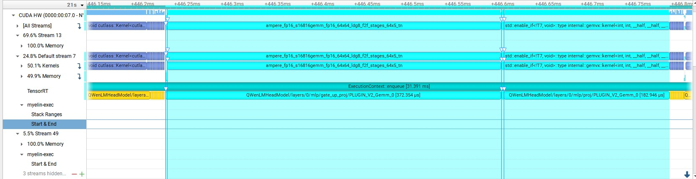
</div>
<div align=center>
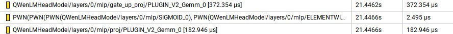
</div>  

此外还实现了`Swiglu Plugin`，但是速度比TensorRT中的原生算法融合慢很多，因此弃用之。  

- **2. RMSNorm**  
每个QWenBlock包含2个`RMSNorm`，整个网络包含64个此结构，在Nsight下发现`RMSNorm`的耗时情况如下图所示： 

<div align=center>
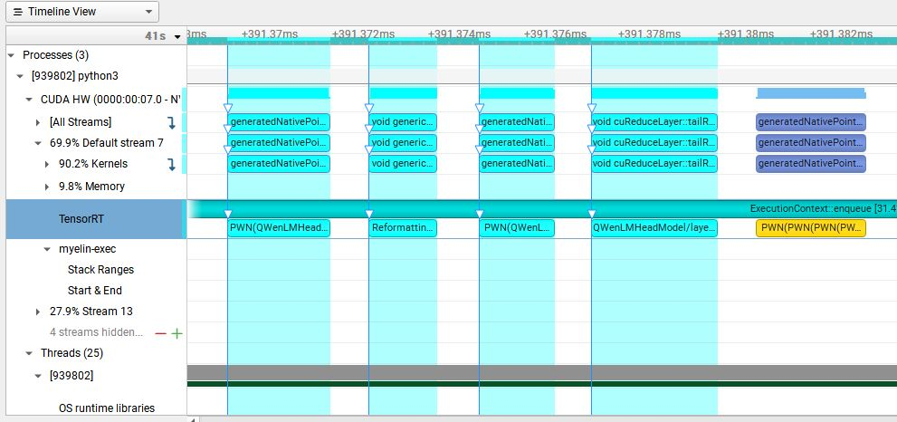
</div>
<div align=center>
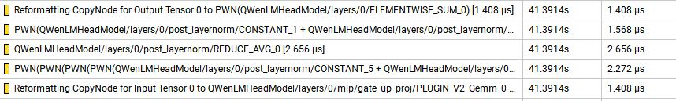
</div>  

其在一个QWenBlock中的一个`RMSNorm`的耗时为9.312us，因此我们对`RMSNorm`进行了优化，实现了`Rmsnorm Plugin`。优化后的耗时为3.776us，较优化前缩短了5.536us，相同位置的`QWenMLP`结构的Nsight如下：  

<div align=center>
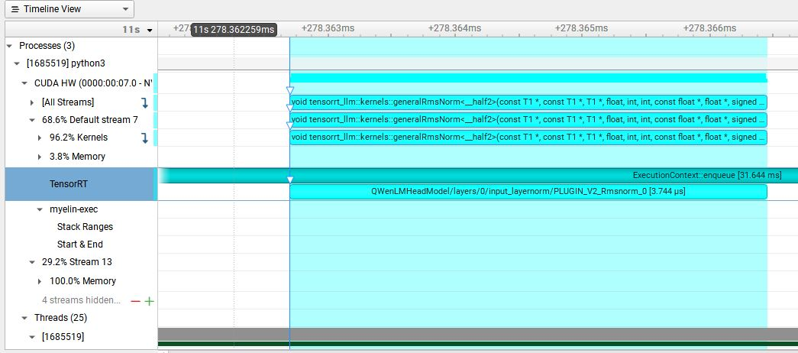
</div>
<div align=center>

</div>  

- **3. int8 kv cache and int8 weight-only**  
我们仿照examples中的代码实现了int8 kv cache和int8 weight-only，我们通过benchmark统计了FP16、FP16+int8 kv cache及int8 weight-only的显存使用情况。运行examples/qwen7b/benchmarks中的benchmark程序可以得到运行结果  
  
```shell
# 以batch_size=1为例
# Run benchmark using the Qwen 7B TRT-LLM model in FP16.
python ./benchmarks/benchmark.py \
    -m qwen \
    --mode plugin \
    --batch_size "1" \
    --input_output_len "10,512" \
    --engine_dir ./trt_engines/qwen/7B/trt_engines/fp16/1-gpu/
    
# Run benchmark using the Qwen 7B TRT-LLM model quantized to INT8.
python ./benchmarks/benchmark.py \
    -m qwen \
    --mode plugin \
    --batch_size "1" \
    --input_output_len "10,512" \
    --use_weight_only \
    --engine_dir ./trt_engines/qwen/7B/trt_engines/weight_only/1-gpu/
```

  | batch_size |  FP16 memory(GB) |  int8 memory(GB)   |  diff(GB) |  
  | :--------: | :--------------: | :--------------:   | :-------: |  
  |     1      |      16.43       |      10.39         |   -6.04   |  
  
  | batch_size |  FP16 memory(GB) |  int8 kv cache(GB) |  diff(GB) |  
  | :--------: | :--------------: | :--------------:   | :-------: |  
  |     1      |      16.43       |      16.27         |   -0.16   |

### 精度与加速结果
- 性能测试  

  我们通过summarize统计了Huggingface FP16、TRT FP16、TRT int8 weight-only的加速情况。运行examples/qwen7b/summarize.py程序可以得到运行结果  
  
```shell
# Run summarization using the Qwen 7B HF model in FP16.
python summarize.py --test_hf \
                    --batch_size 1 \
                    --hf_model_location ./model \
                    --data_type fp16 \
                    --check_accuracy \
                    --tensorrt_llm_rouge1_threshold=14 \
                    --engine_dir ./trt_engines/qwen/7B/trt_engines/fp16/1-gpu/
                    
# Run summarization using the Qwen 7B TRT-LLM model in FP16.
python summarize.py --test_trt_llm \
                    --batch_size 1 \
                    --hf_model_location ./model \
                    --data_type fp16 \
                    --check_accuracy \
                    --tensorrt_llm_rouge1_threshold=14 \
                    --engine_dir ./trt_engines/qwen/7B/trt_engines/fp16/1-gpu/

# Run summarization using the Qwen 7B TRT-LLM model weight quantized to INT8.
python summarize.py --test_trt_llm \
                    --batch_size 1 \
                    --hf_model_location ./model \
                    --data_type fp16 \
                    --check_accuracy \
                    --tensorrt_llm_rouge1_threshold=14 \
                    --engine_dir ./trt_engines/qwen/7B/trt_engines/weight_only/1-gpu/
```  

  - sumarize统计时间(second)  
  
  | batch_size |   Huggingface    |       FP16         |        int8      |  
  | :--------: | :--------------: | :--------------:   | :--------------: |  
  |     1      |       44.6       |       31.3         |        21.7      |  
  
  - 加速比   
  
  | batch_size |   Huggingface    |       FP16         |        int8      |  
  | :--------: | :--------------: | :--------------:   | :--------------: |  
  |     1      |       1.0        |       1.42         |        2.06      |  
  
  
<div align=center>
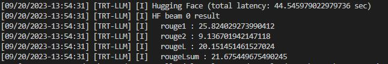
</div>
<div align=center>
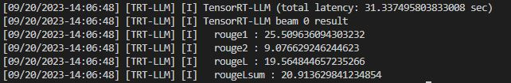
</div>
<div align=center>
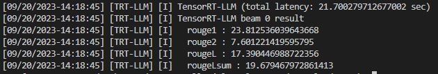
</div>  

  - 精度测试  
  
关于精度测试的验证仿照tests中的代码，采取的方式是绝对误差和相对误差的均值，中位数和最大值。运行examples/qwen7b/test_qwen.py和examples/qwen7b/test_qwen_weight_only.py程序可以得到运行结果  

```shell
# 评估HF输出和TRT-LLM输出的FP16模型精度是否对齐
python test_qwen.py

# 评估HF输出和TRT-LLM输出的INT8模型精度是否对齐
python test_qwen_weight_only.py

```

  |  DataType  |  max abs  |  median abs  |  mean abs  |  max rel  |  median rel  |  mean rel  |  
  | :--------: | :-------: | :----------: | :--------: | :-------: | :----------: | :--------: |  
  |    fp16    |  0.0137   |   0.00195    |  0.00242   |  0.21144  |   0.00225    |  0.00505   |  
  |    int8    |  0.2919   |   0.0359     |  0.0426    |  3.659    |   0.0389     |  0.0893    |  

<div align=center>
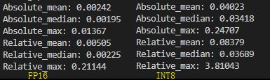
</div>  

  - FP16精度损失主要在gpt attention plugin中，该plugin输出结果和Huggingface输出结果有一定的误差  
  - INT8由于只是对weight进行了对称量化，没有经过SmoothQuant等量化策略，因此输出结果和Huggingface输出结果有较大的误差  

### 送分题答案（可选）

- python3 run.py --max_output_len=8  
```
Input: Born in north-east France, Soyer trained as a
Output:  chef before moving to London in the late
```

- python3 summarize.py --engine_dirtrt_engine/gpt2/fp16/1-gpu --test_hf  --batch_size1  --test_trt_llm  --hf_model_location=gpt2 --check_accuracy --tensorrt_llm_rouge1_threshold=14  
```
[09/06/2023-00:46:00] [TRT-LLM] [I] TensorRT-LLM beam 0 result
[09/06/2023-00:46:00] [TRT-LLM] [I]   rouge1 : 21.869322054781037
[09/06/2023-00:46:00] [TRT-LLM] [I]   rouge2 : 6.258925475911645
[09/06/2023-00:46:00] [TRT-LLM] [I]   rougeL : 16.755771650012953
[09/06/2023-00:46:00] [TRT-LLM] [I]   rougeLsum : 18.68034777724496
[09/06/2023-00:46:00] [TRT-LLM] [I] HF beam 0 result
[09/06/2023-00:46:01] [TRT-LLM] [I]   rouge1 : 18.182978950152904
[09/06/2023-00:46:01] [TRT-LLM] [I]   rouge2 : 5.166241888544473
[09/06/2023-00:46:01] [TRT-LLM] [I]   rougeL : 14.851620358520162
[09/06/2023-00:46:01] [TRT-LLM] [I]   rougeLsum : 16.95757748412272
```

### 未来工作

基于TensorRT-LLM和Plugin我们已经搭建了Qwen-7B模型并做了一定的优化，由于时间关系并未进行SmoothQuant等量化，真的非常遗憾，未来希望持续进一步的优化，未来工作:
- [ ] 整体精度还存在优化空间，未来将进一步优化。
- [ ] pipeline的速度存在一定优化空间，替换更加高效的sample采样方案。
- [ ] rmsnorm plugin和swiglu plugin速度存在优化空间，未来将进一步优化。
- [ ] 尝试SmoothQuant或GPTQ等int8量化方案。

